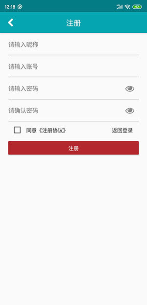
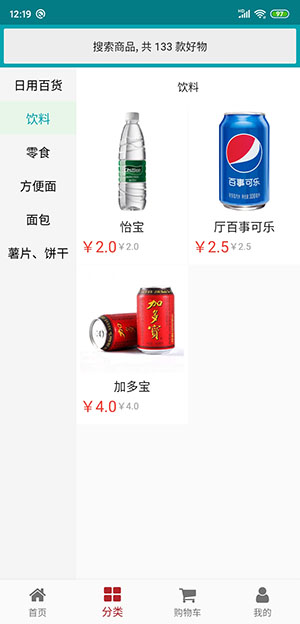

# flutter_shop

flutter 版商城客户端

# 预览图

# 其他版本

主程序[PHP-ZoDream](https://github.com/zx648383079/PHP-ZoDream/tree/master/Module/Shop)：包含api 接口，及pc网页版、手机网页版

其他语言`NET Core`、`Go` 服务端进度慢

vue版[Vue-Shop](https://github.com/zx648383079/Vue-Shop)：好久没更新，所以同步有些问题，一个人做不过来

小程序版[Mini-Shop](https://github.com/zx648383079/Mini-Shop)：market分支为一个小商城，为最新，功能全

flutter版[Flutter-Shop](https://github.com/zx648383079/Flutter-Shop)：目前在做，进入对接功能及完善样式阶段

kotlin版[Kotlin-Shop](https://github.com/zx648383079/Kotlin-Shop)：架构都还没搭完

UWP版[UWP-Shop](https://github.com/zx648383079/UWP-Shop)：有基本的架构，很多页面还没做，

swift版（待定）

Angular版[Angular-ZoDream](https://github.com/zx648383079/Angular-ZoDream)：包括前台及管理后台

## Getting Started

This project is a starting point for a Flutter application.

A few resources to get you started if this is your first Flutter project:

- [Lab: Write your first Flutter app](https://flutter.dev/docs/get-started/codelab)
- [Cookbook: Useful Flutter samples](https://flutter.dev/docs/cookbook)

For help getting started with Flutter, view our
[online documentation](https://flutter.dev/docs), which offers tutorials,
samples, guidance on mobile development, and a full API reference.
